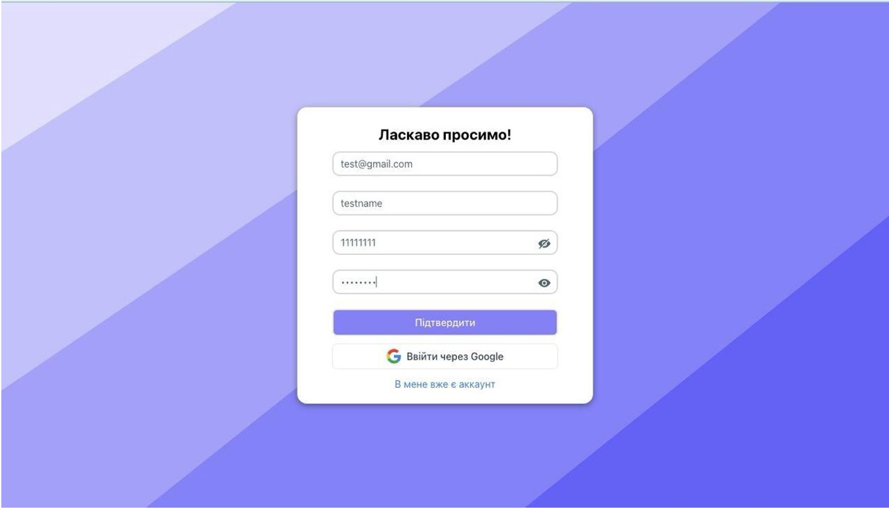
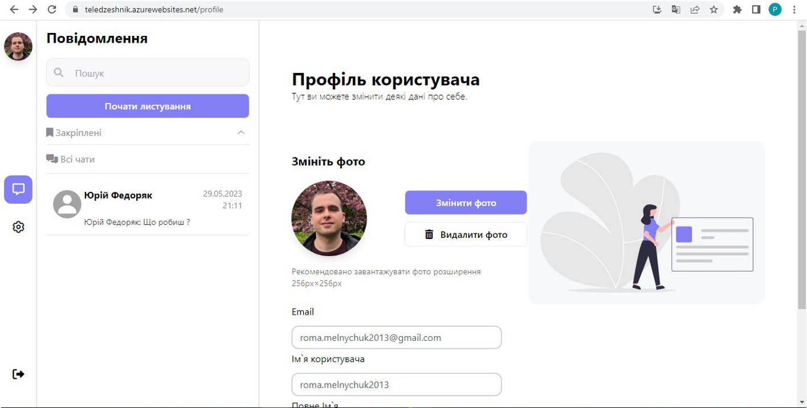
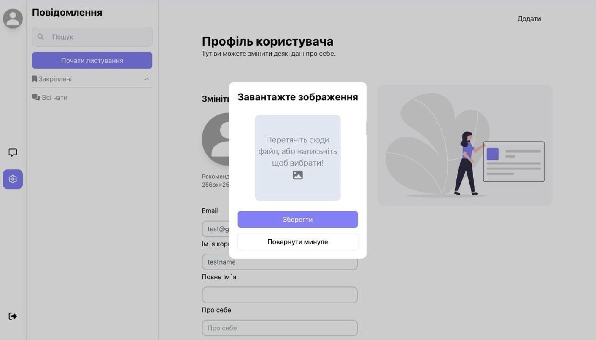
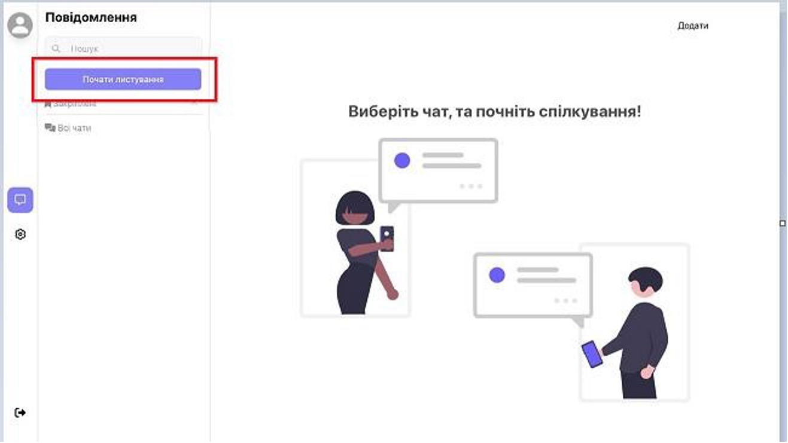
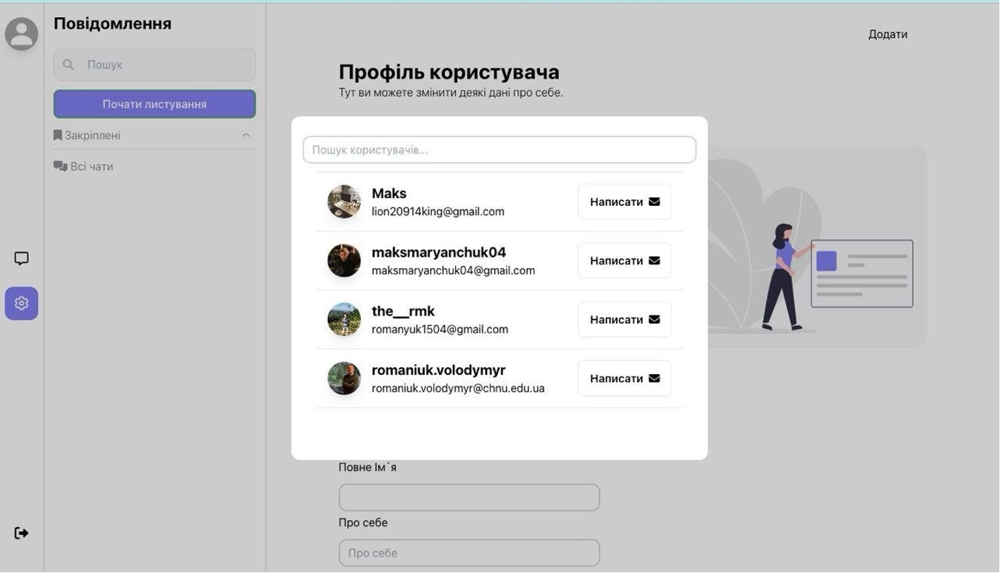
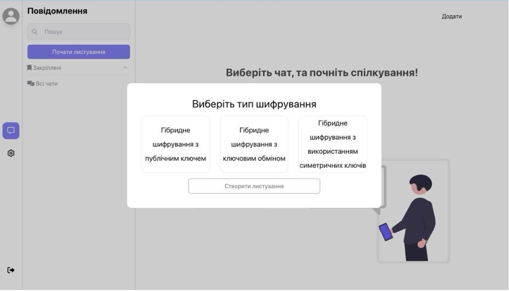
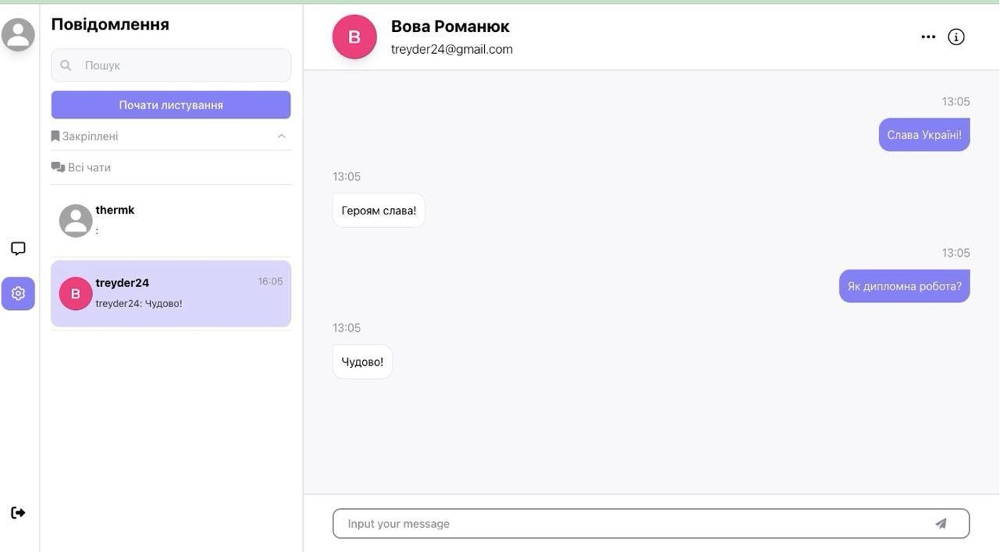
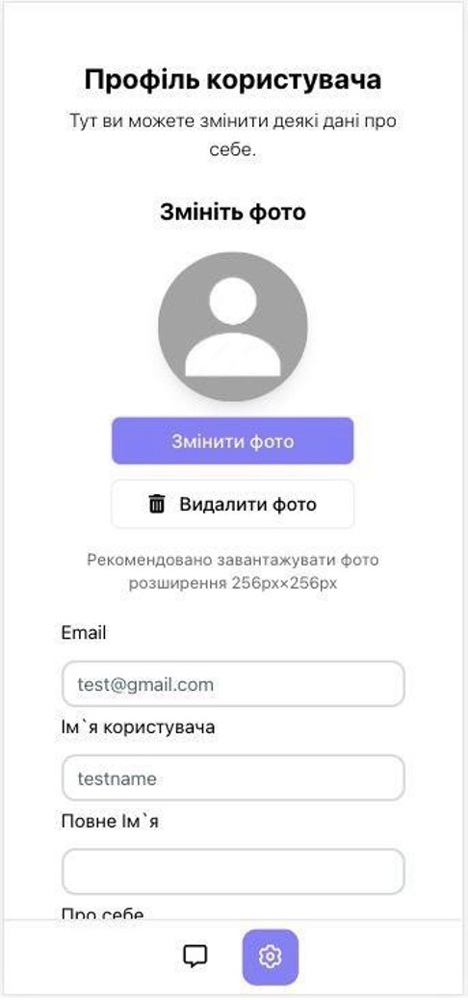
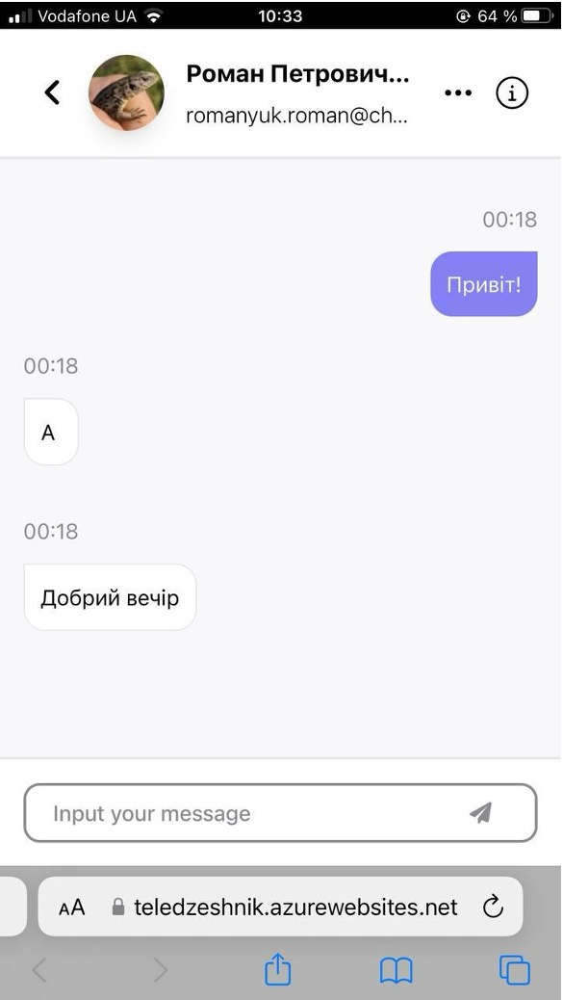

# encrypted-messenger
A secure web-based messenger using hybrid encryption (AES + RSA,Camellia or Blowfish) for end-to-end encrypted communication between users.
## 📌 Features

- User authentication via **Google OAuth** or **custom login & password**
- User profile with photo upload and editable fields
- Encrypted chats using AES + RSA, Camellia або Blowfish
- Create and delete chats, clear messages
- Responsive UI (desktop and mobile)
- Individual key pair storage per user in DB

---

## 🧱 General Architecture

### Frontend:
- React + Redux
- TailwindCSS

### Backend:
- ASP.NET Core (.NET 6)
- MS SQL Server
- Entity Framework Core

### Security:
- AES encryption for messages
- RSA, Camellia or Blowfish encryption for AES keys
- Hybrid encryption approach
- Keys stored securely in database

---

## 🚀 User Flow & Interface

### 🟢 1. User Registration & Login

Users can register via:
- Google (OAuth)
- Custom login and password



---

### 👤 2. User Profile Page

Users have a profile page where they can:
- View and edit personal info
- Upload/change profile photo

  


---

### 💬 3. Start a Chat

Users can:
- Start a new chat
- Select a contact
- Choose encryption method for key exchange (RSA, Camellia, Blowfish)

  
  


---

### 🗨️ 4. Chat Interface

Each conversation supports:
- Real-time AES-encrypted messages
- Key exchange encrypted with selected algorithm
- Timestamps and conversation history



---

### 📱 5. Responsive Design

Accessible from any browser-enabled device.

#### 📄 Profile on Mobile  


#### 💬 Chat on Mobile  


---

## 🧪 Technologies Used

- React, Redux, TailwindCSS
- .NET 6, ASP.NET Core, EF Core
- SQL Server
- JWT Authentication, Google OAuth
- AES (message encryption)
- RSA / Camellia / Blowfish (key encryption)

---

## 🧠 How Hybrid Encryption Works

1. A message is encrypted using AES.
2. The AES key is encrypted using the selected algorithm (RSA, Camellia, or Blowfish).
3. Both the encrypted message and encrypted key are sent to the server.
4. The recipient decrypts the AES key with their private key and then decrypts the message.

---

## 📦 Running the Project

### 🔧 Prerequisites:

- .NET 6 SDK
- Node.js (v16+)
- SQL Server

---

### 🖥️ Backend (ASP.NET Core)

```bash
cd Messenger.Backend
dotnet restore
dotnet run
```

---

### 💻 Frontend (React)

```bash
cd Messenger.Frontend
npm install
npm start
```

---

## 👨‍💻 Author

**Roman Melnychuk**  
📧 Email: roma.melnychuk2013@gmail.com
[My Telegram](https://t.me/roman_melnychuk17)
